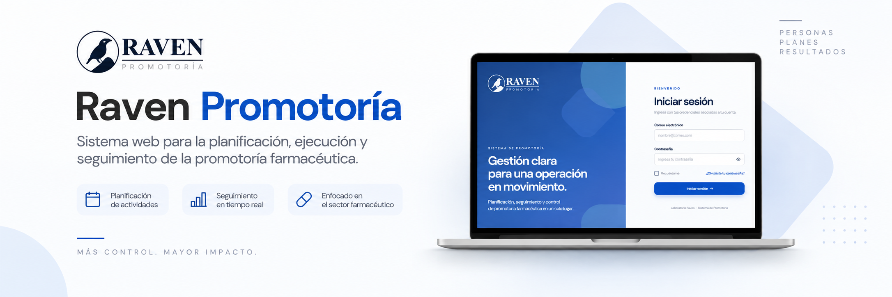

<p align="center">
  
</p>

<h1 align="center">Raven Promotoría</h1>

<p align="center">
  Sistema web para la planificación, ejecución y seguimiento del proceso de promotoría farmacéutica de Laboratorio Raven.
</p>

<p align="center">
  <strong>Laravel 13</strong> · <strong>PHP 8.4</strong> · <strong>Livewire</strong> · <strong>MySQL 8.4</strong> · <strong>Laravel Cloud</strong>
</p>

---

## 📌 Contenido

- [Sobre el proyecto](#-sobre-el-proyecto)
- [Roles del sistema](#-roles-del-sistema)
- [Tecnologías](#-tecnologías)
- [Estado del proyecto](#-estado-del-proyecto)
- [Instalación local](#-instalación-local)
- [Ejecutar el proyecto](#️-ejecutar-el-proyecto)
- [Flujo de trabajo con Git](#-flujo-de-trabajo-con-git)
- [Staging y seguridad](#️-staging-y-seguridad)
- [Trabajo colaborativo](#-trabajo-colaborativo)

---

## ✨ Sobre el proyecto

**Raven Promotoría** centraliza en una sola plataforma la gestión operativa del equipo de promotoría farmacéutica.

La aplicación está pensada para organizar el trabajo desde la planificación hasta el seguimiento, evitando que la información quede dispersa entre archivos, mensajes o controles independientes.

### ¿Qué permitirá gestionar?

- 🏥 Fichero y asignación de farmacias.
- 📅 Planificación de visitas.
- 📍 Registro de visitas y ejecución en campo.
- 🔄 Solicitudes de altas y bajas.
- ✅ Checklist operativo.
- 📊 Indicadores de cobertura, cumplimiento y reportería.

> **Estado actual:** el proyecto ya cuenta con autenticación, roles, gestión de usuarios, protección de rutas, interfaz visual Raven y un ambiente de staging en Laravel Cloud.

---

## 👥 Roles del sistema

| Rol | Alcance principal |
|---|---|
| **Administrador** | Gestiona cuentas, roles y estados de acceso al sistema. |
| **Coordinadora** | Supervisa planificación, farmacias, visitas, solicitudes e indicadores. |
| **Promotora** | Consulta su información asignada y registra planificación, visitas e histórico operativo. |

---

## 🧩 Tecnologías

| Área | Tecnología |
|---|---|
| Backend | Laravel 13 |
| Lenguaje | PHP 8.4 |
| Interfaz | Blade + Livewire |
| Base de datos | MySQL 8.4 |
| Frontend | Vite + CSS |
| Node.js | Node 24 |
| Control de versiones | Git + GitHub |
| Staging | Laravel Cloud |

---

## ✅ Estado del proyecto

### Implementado

- [x] Autenticación
- [x] Recuperación de contraseña
- [x] Configuración y restablecimiento de contraseña
- [x] Roles y permisos
- [x] Protección de rutas
- [x] Gestión administrativa de usuarios
- [x] Activación y desactivación de cuentas
- [x] Interfaz visual Raven
- [x] Páginas 403 y 404
- [x] Base MySQL local
- [x] Staging en Laravel Cloud

### Próximos módulos

- [ ] Fichero de farmacias
- [ ] Asignación de farmacias
- [ ] Importación inicial de datos
- [ ] Planificación de visitas
- [ ] Registro de visitas en campo
- [ ] Checklist operativo
- [ ] Altas y bajas de farmacias
- [ ] Georreferenciación
- [ ] Indicadores y dashboard
- [ ] Reportería

---

## 🚀 Instalación local

Esta sección deja el proyecto listo en una computadora nueva.

### Antes de comenzar

Asegúrate de tener instalados:

- PHP compatible con el proyecto.
- Composer.
- Node.js 24 y npm.
- MySQL 8.4.
- Git.

### 1. Clonar el repositorio

```bash
git clone https://github.com/sofiia-0/raven-promotoria.git
cd raven-promotoria
```

### 2. Instalar dependencias

Dependencias de PHP:

```bash
composer install
```

Dependencias del frontend:

```bash
npm ci
```

### 3. Crear el archivo `.env`

**PowerShell**

```powershell
Copy-Item .env.example .env
```

**CMD**

```cmd
copy .env.example .env
```

### 4. Generar la llave de Laravel

```bash
php artisan key:generate
```

### 5. Crear y configurar la base de datos

Crear una base de datos MySQL local, por ejemplo:

```text
raven_promotoria
```

Luego configurar las credenciales correspondientes en `.env`:

```env
DB_CONNECTION=mysql
DB_HOST=127.0.0.1
DB_PORT=3306
DB_DATABASE=raven_promotoria
DB_USERNAME=root
DB_PASSWORD=
```

> Cada desarrollador utiliza sus propias credenciales locales. El archivo `.env` no se comparte ni se sube a GitHub.

### 6. Ejecutar migraciones

```bash
php artisan migrate
```

### 7. Limpiar la configuración

```bash
php artisan optimize:clear
```

Con esto, la instalación local queda preparada. ✨

---

## ▶️ Ejecutar el proyecto

Para desarrollo se utilizan **dos terminales** abiertas dentro de la carpeta del proyecto.

| Terminal | Comando | Función |
|---|---|---|
| **1 · Laravel** | `php artisan serve` | Ejecuta el backend de Laravel. |
| **2 · Vite** | `npm run dev` | Compila y actualiza los recursos del frontend. |

La aplicación estará disponible normalmente en:

```text
http://127.0.0.1:8000
```

---

## 🌿 Flujo de trabajo con Git

La rama `main` representa siempre una **versión estable y presentable** del sistema.

> ⚠️ No desarrollar directamente sobre `main`.

### Crear una nueva funcionalidad

Primero actualizar la rama principal:

```bash
git switch main
git pull
```

Después crear una rama nueva:

```bash
git switch -c feature/nombre-funcionalidad
```

Ejemplos:

```text
feature/pharmacy-import
feature/pharmacy-assignments
feature/promoter-visits
feature/coordinator-dashboard
```

### Guardar y publicar cambios

```bash
git add .
git commit -m "Descripción clara del cambio"
git push -u origin feature/nombre-funcionalidad
```

Después, la funcionalidad se integra mediante un **Pull Request hacia `main`**.

### Flujo resumido

```text
feature/nueva-funcionalidad
          │
          ▼
     Pull Request
          │
          ▼
        main
          │
          ▼
Laravel Cloud · Staging
```

---

## ☁️ Staging y seguridad

### Staging

La rama `main` está conectada a **Laravel Cloud**. Los cambios integrados pueden desplegarse al ambiente de staging para validación antes de continuar con el desarrollo.

🔗 **Acceso al staging:**  
https://raven-promotoria-staging-npdlua.laravel.cloud/login

El staging utiliza:

- base de datos independiente de las bases locales;
- usuarios y datos de prueba;
- variables de entorno propias;
- despliegue desde GitHub.

> Los datos reales de producción no deben utilizarse en staging.

### Seguridad

Nunca subir al repositorio:

```text
.env
contraseñas
APP_KEY
credenciales MySQL
credenciales de Laravel Cloud
tokens o secretos de servicios externos
```

El archivo `.env` debe permanecer excluido mediante `.gitignore`.

---

## 🤝 Trabajo colaborativo

Cada desarrollador trabaja en un entorno local independiente:

```text
PC propia
  + .env propio
  + base MySQL local propia
  + rama feature independiente
```

Lo que ambos comparten es el código versionado y el ambiente de validación:

```text
Desarrollador A ─┐
                 ├── GitHub ── main ── Laravel Cloud
Desarrollador B ─┘
```

Así pueden trabajar en paralelo sin mezclar configuraciones personales, bases de datos locales ni cambios incompletos.

---

<p align="center">
  <strong>Raven Promotoría</strong><br>
  <sub>Promotoría organizada · Seguimiento claro · Información centralizada</sub>
</p>
